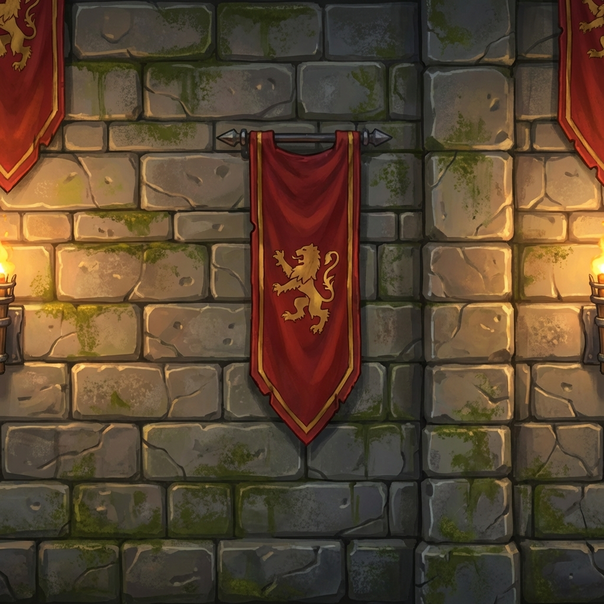
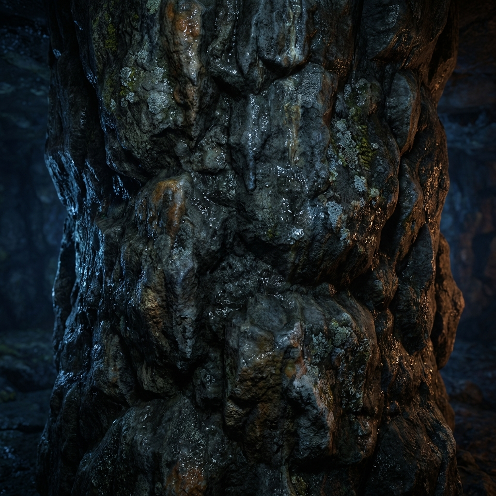

# ⚔️ Weapon Master (웨폰 마스터)

무한히 이어지는 던전을 탐험하며 몬스터를 처치하고 전설적인 무기를 수집하는 **3D 방치형 RPG** 게임입니다.

  
  

## 🎮 게임 플레이
- **자동 전투 (Idle)**: 캐릭터는 자동으로 이동하며 적을 찾아 공격합니다.
- **무기 수집 & 장착**: 적을 처치하고 얻은 골드로 무기를 뽑고, 강력한 무기를 장착하세요.
- **스테이지 공략**: 10 Wave마다 등장하는 보스를 물리치고 다음 테마의 스테이지로 나아가세요.

## ✨ 주요 특징 (Key Features)
- **Real 3D Environments**: 
  - 숲, 던전, 용암동굴, 얼음성, 마왕성 등 **5가지 테마**의 고품질 3D 터널 배경.
  - 스테이지 진행에 따라 배경과 분위기가 동적으로 변화합니다.
- **Dynamic Camera**: 치명타 발생 시 역동적인 카메라 줌인/줌아웃 효과.
- **Web-Based**: 설치 없이 웹 브라우저에서 바로 플레이 가능.

## 🛠️ 기술 스택 (Tech Stack)
- **Core**: HTML5, CSS3, Vanilla JavaScript
- **Graphics**: [Three.js](https://threejs.org/) (3D Rendering)
- **Tools**: VS Code, Git

---
Developed by [Your Name]
